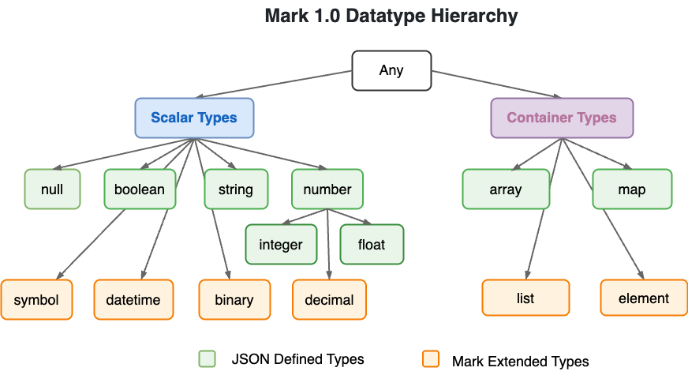

# Mark Notation

[](https://badge.fury.io/js/mark-js)
[](https://github.com/henry-luo/mark/actions/workflows/ci.yml)
[](https://codecov.io/gh/henry-luo/mark)

**Mark** is a unified notation for both object and markup data, combining the best of JSON, HTML, and XML with a clean syntax and succinct data model.

- It has **clean syntax** with **fully-typed** data model *(like JSON, or even better)*
- It is **generic** and **extensible** *(like XML, or even better)*
- It has built-in **mixed content** support *(like HTML5 or even better)*

|                       | Mark    | JSON | HTML | JSX                              | XML         | S-expr  | YAML                                  |
| --------------------- | ------- | ---- | ---- | -------------------------------- | ----------- | ------- | ------------------------------------- |
| Clean syntax          | yes     | yes  | no   | no                               | verbose     | yes     | yes <sub>(only for basic usage)</sub> |
| Fully-typed           | yes     | yes  | no   | partially<br><sub>in {...}</sub> | need schema | yes     | yes                                   |
| Generic               | yes     | yes  | no   | no                               | yes         | yes     | yes                                   |
| Mixed content support | yes     | hard | yes  | yes                              | yes         | hard    | hard                                  |
| Wide adoption         | not yet | yes  | yes  | yes                              | yes         | limited | limited                               |

## Mark Syntax

The major syntax extension Mark makes to JSON is the introduction of a Mark element. It is a JSON object extended with a type name and a list of content items, similar to element in HTML and XML.

For example, a HTML registration form:

```html
<form>
  <div class="form-group">
    <label for="email">Email address:</label>
    <input type="email" id="email">
  </div>
  <div class="form-group">
    <label for="pwd">Password</label>
    <input type="password" id="pwd">
  </div>
  <button class='btn btn-info'>Submit</button>
</form>
```

Could be represented in Mark as:

```mark
<form                                 // element with name 'form'
  <div class:'form-group'             // nested child element
    <label for:email                  // 'for' and its value, both unquoted
      "Email address:"                // text needs to be double quoted
    >                                 // end element with just '>'
    <input type:email, id:email>      // element without child
  >                                   
  <div class:'form-group'             // 'form-group' is a quoted symbol
    <label for:pwd; "Password">       // pwd is an unquoted symbol
    <input type:password, id:pwd>     // attrs separated by comma, like JSON
  >
  <button class:[btn,'btn-info']      // attribute with complex values
    "Submit"                          // comment like in JS!
  >                                   
>
```

You can refer to the [Mark syntax doc](https://mark.js.org/mark-syntax.html) for details.

## Mark Data Model

Mark 1.0 introduced a few new data types: *symbol*, *datetime*, *binary*, and *list*. Together with the existing data types (in Mark 0.11 beta release), they pretty well cover all the commonly used built-in datatypes in JS. And here's the Mark 1.0 datatype hierarchy:

<div align="center"></div>

Roughly speaking, data models of JSON, XML, HTML are subsets of Mark data model, and Mark data model is a subset of JS data model.

<div align="center">

</div>

### Mark element

Each Mark element has 3 facets of data:

- **Element name**, which is mapped to `object.constructor.name` under JavaScript.
- **Attributes**, which is a collection of key-value pairs, stored as normal JavaScript *named properties*.
- **Contents**, which is a list of child objects, stored as *indexed properties* inside the same JavaScript object.

Mark utilizes a novel feature in JavaScript that a plain JS object is actually *array-like*, it can contain both named properties and indexed properties.

So each Mark element is mapped to just **one** plain JavaScript object, which is more compact and efficient compared to other JSON-based DOM models (e.g. [JsonML](http://www.jsonml.org/), [virtual-dom](https://github.com/Matt-Esch/virtual-dom), [MicroXML](https://dvcs.w3.org/hg/microxml/raw-file/tip/spec/microxml.html)), and is more intuitive to use under JS.

You can refer to the [Mark data model doc](https://mark.js.org/mark-model.html) for details.

## Mark vs. Other Formats
### Mark vs. JSON

Mark is a superset of JSON. It extends JSON notation with additional scalar and container types.

Compared to JSON, Mark has the following advantages:

- Additional scalar types supported under Mark, including: *symbol*, *decimal number*, *datetime*, *binary* (essentially covering all commonly used built-in data types under JS).
- Mark supports a new container type: ***element***. Mark *element* has a type-name, which is important in identifying what the data represents; whereas JSON map is actually an anonymous object, missing the type name.
- Mark element has built-in mixed-content support, like in HTML and XML, which is awkward for JSON.
- Mark incorporates some syntax enhancements to JSON (e.g. allowing comments, name without quotes, etc.), thus making the format even more friendly to use than JSON.

Some disadvantages of Mark, compared to JSON:

- It is no longer a subset of JavaScript literal syntax, although a Mark object is still a simple POJO in JS data model.
- It does not yet have wide support, like JSON, at the moment.

### Mark vs. HTML/JSX

Compared to HTML/JSX, Mark has the following advantages:

- Mark is a generic data format, whereas HTML is a specialized format for web content.
- It does not have whitespace ambiguity, as the text objects are quoted explicitly. It can be minified or prettified without worrying about changing the underlying content.
- Mark attributes can have complex values, like JSON, not just quoted string values as in HTML.
- It has a very clean syntax, whereas HTML5 parsing is complicated, e.g. the non-extensible and error-prone self-closing syntax rules.
- Mark contains just a hierarchy of POJO objects, which can be easily processed using the built-in JS language or any 3rd party libraries, without the need of complex DOM APIs. Making it an ideal for virtual DOM and other application usages.

### Mark vs. XML

Compared to XML, Mark has the following advantages:

- Mark attributes can have complex objects as values; whereas XML attribute values always need to be quoted, and cannot have complex objects as values.
- Mark syntax is much cleaner than XML. No whitespace ambiguity. No verbose closing tag. Does not have legacies like DTD, which is half-baked for full schema definition. 
- The data model produced by Mark is fully typed, like JSON; whereas XML is only semi-typed, when there's no schema.
- Simple POJO vs. complex DOM APIs.

### Mark vs. S-expressions

Lisp and S-expression gave rise to novel ideas like high-order composition, self-hosting program, data as code, code as data, etc.. It's the source of inspiration of Mark and [Lambda Script](https://github.com/henry-luo/lambda).

The advantage of Mark over S-expressions is that it takes a more modern, web-first approach in its design, making it more readily usable in web and Node.js environments.

## Using Mark

### mark.js library

`mark.js` is the JS library to work with data in Mark format. It consists of 4 modules:

- The core module `mark.js`, which provides `parse()` and `stringify()` functions, like JSON, and a direct Mark object construction function `Mark()`, and some functional APIs to work with the object content.
- Sub-module `mark.mutate.js`, which provides mutative APIs to change the Mark object data model.
- Sub-module `mark.convert.js`, which provides conversion between Mark format and other formats like HTML and XML.
- Sub-module `mark.selector.js`, which provides CSS selector based query interface on the Mark object model, like jQuery.

### mark.js installation

Install from NPM:

```
npm install mark-js --save
```

Then in your node script, use it as:

```js
const Mark = require('mark-js');
var obj = Mark.parse(`<div <span "Hello World!">>`);
console.log("Greeting from Mark: " + Mark.stringify(obj));
```

To use the library in browser, you can include the `mark.js` under `/dist` directory into your html page, like:

```html
<script src='mark.js'></script>
<script>
var obj = Mark(`<div <span "Hello World!">>`);  // using a shorthand
console.log("Greeting from Mark: " + Mark.stringify(obj));
</script>
```

Note: /dist/mark.js has bundled all sub-modules and all dependencies with it, and is meant to run in browser. The entire script is about 14K after gzip. It supports latest browsers, including Chrome, Safari, Firefox, Edge. (*Legacy browser IE is not supported.*)

*If you just want the core functional API, without the sub-modules, you can also use mark.core.js, which is only 7K after gzip. You can also refer to the package.json to create your own custom bundle with the sub-modules you need.*

### VS Code extension

And here's the [Mark VSC Extension](https://marketplace.visualstudio.com/items?itemName=henryluo.mark-vsce) to help syntax highlight Mark documents when you edit it in VS Code.

## Documentation

- [Syntax documentation](https://mark.js.org/syntax)
- [Data model documentation](https://mark.js.org/data-model)
- [API documentation](https://mark.js.org/api)
- [FAQ](https://mark.js.org/faq)
- Hacker News discussion about [Mark beta release](https://news.ycombinator.com/item?id=16308581)
- Hacker News discussion about [Mark 1.0 release](https://news.ycombinator.com/item?id=44604474)

## 1.0 and Beyond

Mark 1.0 release just mark the start of a long journey to make web a better platform to store and exchange both object and markup data.

1.0 release just means whatever is released in this version will receive backward compatible support in the foreseeable future like the ever-green HTML. 

Some of the planned further enhancements include:
- Namespace support;
- ID and IDREF support;

For a new notation to be widely adopted, just defining the syntax and data model is not enough. It needs languages, tools and eco-system to work with it. Thus a new project, [Lambda Script](https://github.com/henry-luo/lambda), has been started to develop a general-purpose, pure functional language to validate, query, transform, and present data stored in Mark format.

Your contribution and feedback to both projects are welcome.

## Credits

Thanks to the following platforms or services that support the open source development of Mark: NPM, GitHub,  [Codecov](https://codecov.io/), [JS.org](https://js.org/).
