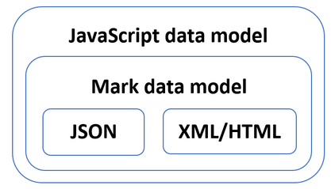

# Data Model

Mark has a simple and fully-typed data model. It is an extension to the JSON data model.

## Overview

Mark extends JSON data model with several new data types:
- **Scalar types**: symbol, datetime, binary, and decimal number
- **Container types**: list and element

With these additions, essentially all commonly used built-in data types are well represented under Mark.

Mark's data model is designed so that a well-formed HTML or XML document can be converted into Mark document without any loss in data model.

Roughly speaking, JSON, HTML and XML data models are subsets of Mark data model, and Mark data model is a subset of JS data model.

<div align="center">

</div>

## Mark Element Structure

A Mark element contains 3 facets of data in its data model:

### 1. Element Name

A string that represents the type name of the Mark object, which is like element name in HTML/XML.

```javascript
const element = Mark.parse('<div>');
console.log(element.constructor.name); // "div"
```

### 2. Properties

A collection of key-value pairs, like properties of JSON objects, and attributes of HTML/XML elements.

**Important rules:**
- For Mark objects, property keys **cannot be numeric** (reserved for content)
- Property keys must be **unique** within the same object
- JSON objects in Mark can still have all kinds of keys

```javascript
const element = Mark.parse('<div class:"container" id:"main">');
console.log(element.class); // "container"
console.log(element.id);    // "main"
```

### 3. Contents

An ordered list of content objects, like child nodes of elements in HTML/XML. Mark utilizes a novel feature of JavaScript where objects can be array-like, storing both named properties and indexed properties.

```javascript
const element = Mark.parse('<div "Hello" <span "World">>');
console.log(element[0]); // "Hello"
console.log(element[1].constructor.name); // "span"
console.log(element.length); // 2
```

## Data Type Extensions

### 1. Symbol

Mark symbols are single-quoted identifiers or unquoted valid identifiers:

```javascript
const obj = Mark.parse("<config theme:'dark' debug:false>");
console.log(typeof obj.theme); // "string" (symbols become strings in JS)
console.log(obj.debug);        // false
```

### 2. Datetime

ISO 8601 datetime strings quoted in `t'...'`:

```javascript
const event = Mark.parse("<event start:t'2025-01-01T10:00:00Z'>");
console.log(event.start instanceof Date); // true
```

### 3. Binary

Binary objects represented by ArrayBuffer, decoded from base64 or hex encoding:

```javascript
const data = Mark.parse("<data hex:b'\\x48656c6c6f'>");
console.log(data.hex instanceof ArrayBuffer); // true
console.log(data.hex.encoding); // "hex"
```

**Note:** Unlike strings, consecutive binary objects within content are not merged.

### 4. Decimal

Big decimal numbers postfixed with 'n':

```javascript
const big = Mark.parse('<number value:123456789012345678901234567890n>');
console.log(typeof big.value); // "bigint"
```

## Content Normalization

Mark performs the following normalization on element content:

- **Null values** are discarded
- **Consecutive strings** are merged into one single string  
- **Arrays** in element content have their items auto-spread/flattened

These normalizations make Mark more friendly for mixed-content use cases.

**Example:**

```javascript
// This Mark notation...
const element = Mark.parse('<div "Hello" null "World" ["a" "b"]>');

// Results in normalized content:
console.log(element[0]); // "HelloWorld" (strings merged)
console.log(element[1]); // "a" (array flattened)
console.log(element[2]); // "b"
console.log(element.length); // 3 (null discarded)
```

## JavaScript Integration

### Array-like Behavior

Mark objects support array methods for working with content:

```javascript
const list = Mark.parse('<list "apple" "banana" "cherry">');

// Array methods work
const filtered = list.filter(item => item.includes('a'));
console.log(filtered); // ["apple", "banana"]

// Iteration works
for (let item of list) {
  console.log(item);
}

// Length property
console.log(list.length); // 3
```

### Property Enumeration

Content items are non-enumerable, so `for...in` loops only iterate over properties:

```javascript
const obj = Mark.parse('<user name:"Alice" age:30 "bio" "info">');

// Only properties appear in for...in
for (let prop in obj) {
  console.log(prop); // "name", "age" (not "bio" or "info")
}

// Use for...of for content
for (let item of obj) {
  console.log(item); // "bio", "info"
}
```

### Type Checking

```javascript
const mark = Mark.parse('<test>');
const plain = { test: true };

console.log(Mark.isMark(mark));  // true
console.log(Mark.isMark(plain)); // false
```

## Comparison with Other Models

### Mark vs JSON

| Feature | JSON | Mark |
|---------|------|------|
| Type information | None | Built-in type names |
| Mixed content | Difficult | Native support |
| Data types | 6 basic types | Extended type system |
| Object structure | Maps only | Maps + array-like content |

### Mark vs HTML/XML DOM

| Feature | DOM | Mark |
|---------|-----|------|
| Node types | Multiple node types | Unified object model |
| JavaScript integration | DOM API required | Plain objects |
| Memory overhead | High | Low |
| Serialization | Complex | Simple |

### Mark vs Virtual DOM

| Feature | Virtual DOM | Mark |
|---------|-------------|------|
| Purpose | UI rendering | Data representation |
| Reconciliation | Built-in | Not needed |
| Props vs attributes | Separate concepts | Unified as properties |
| Children handling | Special prop | Array-like content |

## Best Practices

### 1. Leverage Type Names

Use meaningful type names that describe your data:

```javascript
// Good
const user = Mark('user', { id: 1, name: 'Alice' });
const product = Mark('product', { sku: 'ABC123', price: 29.99 });

// Avoid generic names
const thing = Mark('object', { data: 'value' });
```

### 2. Use Mixed Content Appropriately

Mixed content is powerful for document-oriented data:

```javascript
// Good use of mixed content
const article = Mark.parse(`<article
  <h1 "Introduction to Mark">
  <p "Mark notation combines " <em "structure"> " and " <em "content"> ".">
>`);

// Don't force mixed content where arrays are better
const coordinates = Mark('point', { x: 10, y: 20 }); // Better than mixed content
```

### 3. Understand Property vs Content

- Use **properties** for metadata and attributes
- Use **content** for data and child elements

```javascript
// Clear separation
const blogPost = Mark('post', 
  { id: 123, published: true },  // metadata as properties
  ['Post content goes here']     // actual content
);
```

For detailed information about the JavaScript API for working with Mark objects, see the [API Reference](api.md).

### Property Access

Properties can be accessed using dot notation or bracket notation:

```javascript
const obj = Mark.parse(`{config host:"localhost" port:3000}`);

// Dot notation
console.log(obj.host); // "localhost"
console.log(obj.port); // 3000

// Bracket notation
console.log(obj["host"]); // "localhost"
console.log(obj["port"]); // 3000
```

### Content Access

Content is accessed using array-like indexing:

```javascript
const list = Mark.parse(`{list "item1" "item2" "item3"}`);

// Array-like access
console.log(list[0]); // "item1"
console.log(list[1]); // "item2"
console.log(list[2]); // "item3"
console.log(list.length); // 3

// Array methods work
list.forEach((item, index) => {
  console.log(`${index}: ${item}`);
});
```

## JavaScript Mapping

### Plain Old JavaScript Objects (POJOs)

Mark objects are plain JavaScript objects, not instances of special classes:

```javascript
const obj = Mark.parse(`{user name:"Alice" age:30}`);

console.log(obj.constructor === Object); // false (dynamic constructor)
console.log(obj.__proto__ === Object.prototype); // true
console.log(Object.getPrototypeOf(obj) === Object.prototype); // true
```

### Serialization Compatibility

Mark objects work seamlessly with JSON serialization:

```javascript
const mark = Mark.parse(`{user name:"Alice" posts:["post1" "post2"]}`);

// JSON serialization
const json = JSON.stringify(mark);
console.log(json); // {"0":"post1","1":"post2","name":"Alice","posts":["post1","post2"]}

// JSON deserialization
const restored = JSON.parse(json);
// Note: type information is lost in JSON
```

### Object Enumeration

Properties and content can be enumerated using standard JavaScript methods:

```javascript
const obj = Mark.parse(`{config debug:true port:3000 "item1" "item2"}`);

// Enumerate all properties (including indexed)
Object.keys(obj); // ["0", "1", "debug", "port"]

// Enumerate only named properties
Object.keys(obj).filter(key => isNaN(key)); // ["debug", "port"]

// Enumerate only content
Object.keys(obj).filter(key => !isNaN(key)); // ["0", "1"]
```

## Memory Layout

### Efficient Storage

Mark objects store both properties and content in a single JavaScript object:

```javascript
const element = Mark.parse(`{div id:"main" class:"container" "Text" {span "nested"}}`);

// Internal structure (conceptual):
// {
//   "constructor": { name: "div" },
//   "id": "main",
//   "class": "container",
//   "0": "Text",
//   "1": { constructor: { name: "span" }, "0": "nested", length: 1 },
//   "length": 2
// }
```

### Performance Characteristics

- **Memory efficient**: Single object instead of separate properties/content containers
- **Fast property access**: Direct JavaScript property lookup
- **Fast content access**: Direct array-like indexing
- **Minimal overhead**: No wrapper classes or proxies

## Type Coercion and Compatibility

### Automatic Type Conversion

Mark objects participate in JavaScript's type coercion:

```javascript
const num = Mark.parse(`{number 42}`);
console.log(num + 8); // "42" + 8 = "428" (string concatenation)
console.log(+num[0] + 8); // 42 + 8 = 50 (numeric addition)
```

### Truthiness

Mark objects are always truthy:

```javascript
const empty = Mark.parse(`{empty}`);
const withContent = Mark.parse(`{item "content"}`);

console.log(!!empty); // true
console.log(!!withContent); // true
```

### Array-like Behavior

Mark objects with content behave like arrays for many operations:

```javascript
const list = Mark.parse(`{list "a" "b" "c"}`);

// Array methods
console.log(Array.from(list)); // ["a", "b", "c"]
console.log([...list]); // ["a", "b", "c"] (spread operator)

// Array destructuring
const [first, second, third] = list;
console.log(first); // "a"
```

## Nested Object Handling

### Deep Nesting

Mark supports arbitrary nesting depth:

```javascript
const deep = Mark.parse(`{level1 {level2 {level3 {level4 "deep value"}}}}`);

console.log(deep.level2.level3.level4[0]); // "deep value"
```

### Circular References

Mark objects can contain circular references (created programmatically):

```javascript
const parent = Mark('parent');
const child = Mark('child');

parent.child = child;
child.parent = parent; // Circular reference

// Note: Circular references will cause issues with JSON.stringify
```

## Data Model Comparison

### Mark vs JSON Data Model

| Aspect | Mark | JSON |
|--------|------|------|
| Type information | ✅ Preserved | ❌ Lost |
| Mixed content | ✅ Native support | ❌ Requires arrays |
| Object structure | Single object | Nested objects |
| Memory efficiency | High | Lower |
| JavaScript integration | Seamless | Good |

### Mark vs DOM Data Model

| Aspect | Mark | DOM |
|--------|------|-----|
| Object type | Plain objects | Element nodes |
| Property access | Direct | getAttribute() |
| Content access | Array-like | childNodes |
| Memory usage | Efficient | Higher overhead |
| Manipulation | JavaScript native | DOM APIs |

## Best Practices

### Working with Properties

```javascript
// Good: Check property existence
const obj = Mark.parse(`{config port:3000}`);
if ('host' in obj) {
  console.log(obj.host);
}

// Good: Provide defaults
const host = obj.host || 'localhost';
```

### Working with Content

```javascript
// Good: Check content length
const list = Mark.parse(`{list "item1" "item2"}`);
if (list.length > 0) {
  console.log(list[0]);
}

// Good: Use array methods safely
const items = Array.from(list);
```

### Type Checking

```javascript
// Good: Check constructor name
function isMarkType(obj, typeName) {
  return obj && obj.constructor && obj.constructor.name === typeName;
}

const user = Mark.parse(`{user name:"Alice"}`);
console.log(isMarkType(user, 'user')); // true
```

?> **Performance Tip**: Mark objects are optimized for read access. If you need to frequently modify content, consider using array methods like `push()`, `pop()`, `splice()` which maintain the `length` property automatically.
