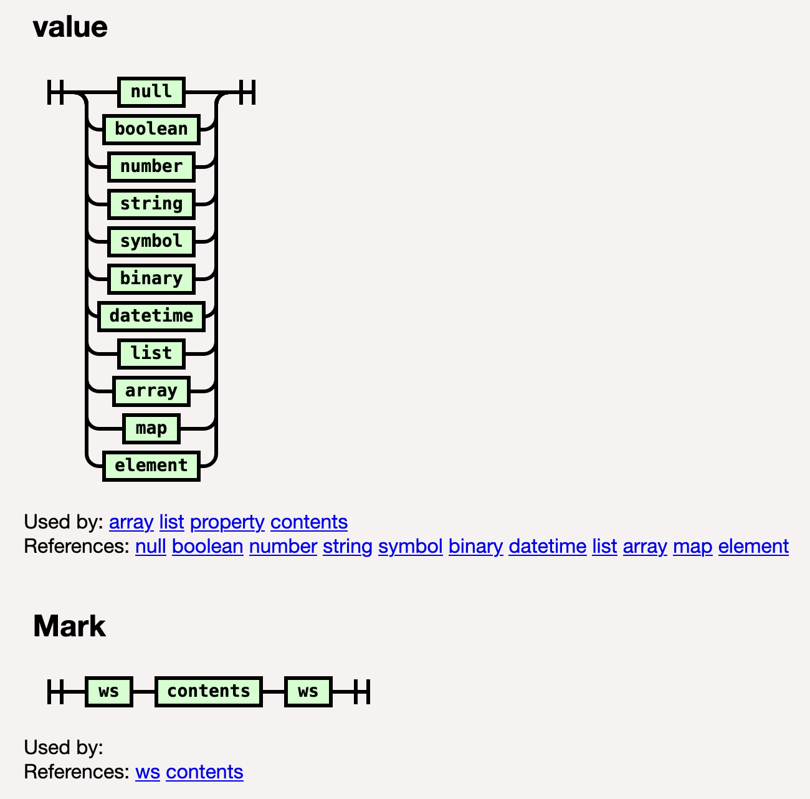

# Mark Syntax

Mark syntax is a superset of JSON. The primary extension that Mark makes to JSON is the introduction of a new object notation to support markup data, commonly seen in HTML and XML.

## 1. Mark Object

Below are the key grammar rules for the new Mark object in BNF notation:

```BNF
Mark ::= value     /* root of Mark grammar */

value ::= null | boolean | number | string | binary | array | json_object | mark_object | mark_pragma

mark_object ::= '{' type_name properties contents '}'

type_name ::= key

key ::= string | identifier
```

*(Note: for clarify, whitespace rules are omitted in the grammar above. You can refer to the [formal BNF](mark.bnf).)*

Comparing to a JSON object, a Mark object has two extensions:

- A **type name**, which corresponds to class name or type name of an object. In JavaScript, that is `obj.constructor.name`. In HTML and XML, that's the element name.
- Optional list of **content** values following the named properties, which corresponds to child nodes in markup documents like HTML and XML.

### 1.1 Object Properties

```BNF
properties ::= (property ','?)*

property ::= key ':' value

identifier ::= begin_identifier continue_identifier*

begin_identifier ::= [a-zA-Z] | '_' | '$'

continue_identifier ::= begin_identifier | digit | '-' | '.'
```

- Property key and value can be unquoted if they’re valid identifiers.  JS reserved keywords (like `default`) are valid unquoted keys in Mark. However, it is recommended that you avoid using JS keywords, or JS and Mark object prototype function names as property keys, as they could cause confusion, inconvenience and even errors (as the underlying functions are overridden).
- Comparing to JS identifier, Mark identifier allows dash '-' and dot '.' in it. These two special characters are added as they are commonly used in markup formats, like HTML, CSS, XML.
- Property keys and values can be single, double or triple quoted.
- Property keys can be any string **except a number**, which is reserved for Mark object contents. (This restriction does not apply to JSON properties.)
- Property keys are **case-sensitive**.
- Property keys **must be unique** (for both Mark and JSON object).
- Comma between properties is optional, and last property can have trailing comma.

### 1.2 Object Contents

```BNF
contents ::= (text | binary | json_object | mark_object | mark_pragma)*
```

- To better support mixed content, not all Mark values are allowed in the contents of a Mark object. Array, number, boolean and null values are not allowed.
- Consecutive text values are merged into a single text value.

## 2. Mark Pragma

Mark pragma is a sequence of characters enclosed in brackets `( ... )`. It has two syntax forms. The general form is quoted in `(? ... ?)`, and the pair form is quoted in `( ... )`. 

In the general form, character `?` needs to be escaped with double `??`. 

In paired form, no character needs to be escaped. It can contain embedded brackets, as long as they are balanced. Outer brackets are delimiters, whereas embedded brackets are part of the pragma content.

```BNF
mark_pragma ::= general_pragma | paired_pragma
general_pragma ::= '(?' (char_no_qmark | '??')* '?)' 
paired_pragma ::= '(' (char_no_bracket | mark_pragma)* ')' 
```

It can be used for content like comments in HTML and processing instructions in XML, and embedded expressions in templates.

## 3. Other Syntax Extensions to JSON

Other syntax extensions made to JSON are pretty much just syntax sugars, some inspired by [JSON5](http://json5.org/).

### 3.1 Unique property keys

- Property keys of JSON object in Mark must be **unique** under the same object. (JSON spec has left this open, and there are many implementations that accept duplicate keys. This is probably an overlooked issue in initial JSON design.)

### 3.2 Arrays

- Comma between array items are optional, and last item in array can have a trailing comma.

### 3.3 Strings

- Strings can be single or double quoted.
- Strings can split across multiple lines.
- String can also be triple-quoted with single or double quote character, similar to Python or Scala.
  - The quoted sequence of characters is arbitrary, except that it may contain three or more consecutive quote characters only at the very end. Escape sequences are not interpreted.
- Unlike JSON string, control characters, like Tab and Line Feed, are allowed in Mark string. Actually, all Unicode characters are allowed in Mark string, just like JS string. Only double-quote ("),  single-quote (') and back-slash (\\) need to be escaped.

### 3.4 Numbers

- Numbers can begin or end with a (leading or trailing) decimal point.
- Numbers can include `Infinity`, `-Infinity`,  `NaN`, and `-NaN`.
- Numbers can begin with an explicit plus sign.

### 3.5 Binary Value

- Binary data can be encoded as a sequence of characters delimited by `[#]` and `]`. 
- It can encoded in either [base64](https://en.wikipedia.org/wiki/Base64) or [ascii85](https://en.wikipedia.org/wiki/Ascii85) *(Adobe version)* encoding.
- Whitespaces are allowed between the encoded characters and are ignored by the parser. 

```BNF
binary ::=  base64_binary | ascii85_binary

base64_binary ::= '[#' ([0-9a-zA-Z] | '+' | '/' | ws_char)* '='? '='? ']'

ascii85_binary ::= '[#~' ([#x21-u] | 'z' | ws_char)* '~]'
```

### 3.6 Comments

- Both inline (single-line)  `//...` and block (multi-line) comments `/* ... */` are allowed in Mark, similar to those in JS.
- One difference is that, Mark block comment can be nested, whereas JS block comment cannot be nested.

## 4. Full Grammar Specification

The formal grammar specification in BNF is [here](mark.bnf).

Following the JSON convention, a [railroad diagram](https://mark.js.org/mark-grammar.html) of the entire grammar is also provided to help you visualize the grammar. You can click on the grammar terms to navigate around. Below is a snapshot of the top-level of the grammar.


